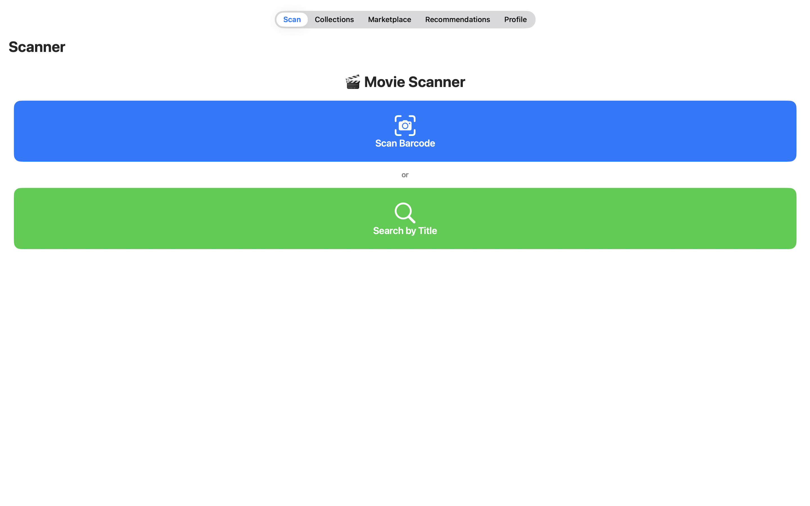
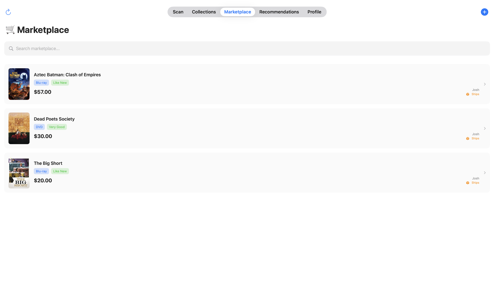
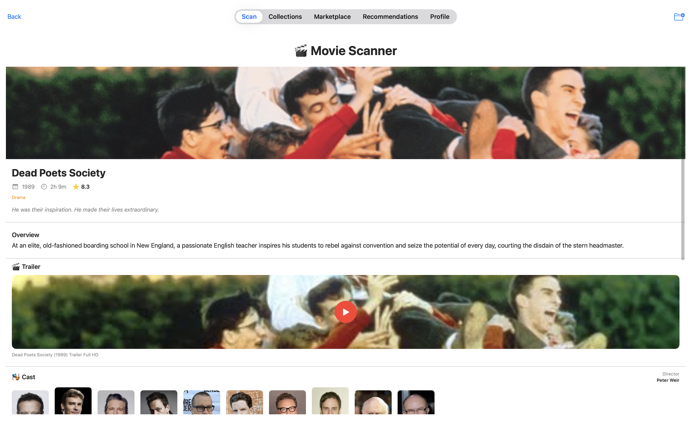
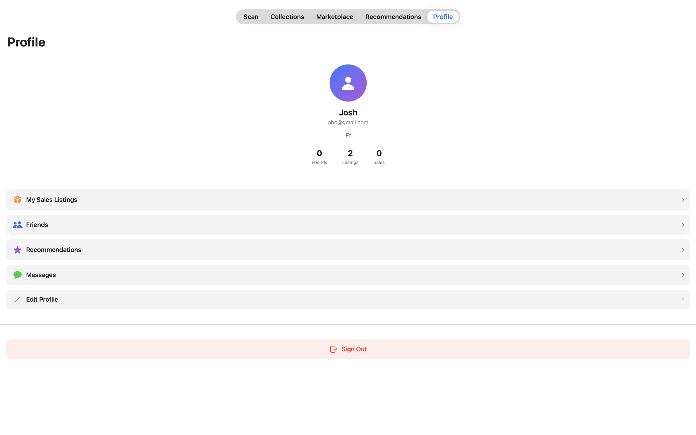

# MovieScanner

MovieScanner is an iOS app for movie collectors that combines barcode scanning, digital cataloging, and community features. Scan physical media (DVD / Blu-ray / 4K UHD), fetch movie details, build your personal collection, and discover movies through recommendations and a marketplace-style sharing flow.

> Status: Actively developing. Some community/marketplace features are still in progress.

---

## Highlights
- Scan barcodes in real time and automatically look up movies
- Rich movie detail pages (posters, ratings, trailers, cast/crew, reviews)
- Personal collections with offline persistence (Core Data)
- Community recommendations + marketplace-style listings (Firebase)

---

## Screenshots
Add screenshots/GIFs under `/screenshots` and update the paths below.

<p align="center">
  
  
  
</p>

<p align="center">
  
  
</p>

> Note: Screenshots can be added later—this section is optional but strongly recommended.

---

## Features

### Barcode scanning & search
- Real-time barcode scanning using the device camera
- Supports common formats (EAN-13, UPC-E, Code 128, Code 39, etc.)
- Automatic lookup via UPC database APIs
- Title cleanup for better results (removes “Blu-ray”, “DVD”, “4K”, etc.)
- Manual search fallback (grouped by decade)
- Haptic feedback on successful scans

### Movie information (TMDb)
- Posters and backdrop images
- Ratings (out of 10), overview/tagline, release year, runtime, genres
- Trailers (YouTube)
- Cast & crew (top cast + director)
- Reviews (expandable text)

### Personal collections (offline)
- Collections: Planning to Watch, Favorites, Search History
- Filtering by genre + smart date grouping (Today / Yesterday / This Week / This Month)
- Swipe-to-delete, duplicate prevention
- Offline access via Core Data persistence

### Marketplace (community listings)
- Create listings from your collection (price, format, condition, shipping toggle)
- Browse/search listings + view seller info
- Listing management (edit, mark sold/pending/removed)
- Basic dashboard metrics (views/status) *(as implemented)*

### Recommendations (community)
- Post recommendations with ratings and written reviews
- Browse posts with sorting (Trending / Recent / Top Rated)
- Like/unlike with real-time counters
- Search by title, username, or genre
- Manage your own posts (delete)

### Authentication & profiles
- Email/password authentication (Firebase Authentication)
- Username uniqueness validation and form validation
- Profile editing (bio, basic stats) *(as implemented)*
- Seller rating system *(planned/coming soon)*

---

## Tech Stack

### iOS / Frontend
- Swift 5.9+
- SwiftUI 4.0+
- Architecture: MVVM
- Barcode scanning: AVFoundation
- Concurrency: async/await, MainActor
- Networking: URLSession (async/await)
- Combine (where useful)
- UIKit bridging where needed (UIViewControllerRepresentable)

### Backend / Data
- Firebase Authentication
- Firebase Cloud Firestore (marketplace, recommendations, user profiles)
- Core Data (offline personal collections)

### APIs
- TMDb API (movie metadata, posters, cast, trailers, reviews)
- OpenFoodFacts API (UPC → product name conversion)
- BarcodeLookup API (optional alternative UPC source)

---

## Getting Started

### Prerequisites
- macOS Monterey (12.0) or later
- Xcode 15+  
- iOS 16+ deployment target
- TMDb API key
- Firebase project (free tier is fine)

### Installation
1. Clone the repository
   ```bash
   git clone https://github.com/<gim0317>/MovieScanner.git
   cd MovieScanner
